# Class Diagram Chi Tiet Toan Bo Du An VinhKhanhTourGuide

Tai lieu nay ve class diagram o muc chi tiet cho 3 phan he:

- `Mobile App (MAUI)`
- `Web API (ASP.NET Core)`
- `Web Admin (ASP.NET Core MVC)`

Luu y:

- So do tap trung vao class nghiep vu, data, service, controller va view-model.
- Khong dua migration va class platform-specific vao de tranh lam so do qua roi.
- Cac class `Poi`, `ListeningLog`, `VisitorActivity` xuat hien o nhieu project vi moi project giu model rieng theo pham vi cua no.

```mermaid
classDiagram
direction LR

class Application
class Shell
class ContentPage
class DbContext
class Controller
class ControllerBase

namespace MobileApp {
    class App {
    }

    class AppShell {
    }

    class MauiProgram {
        +CreateMauiApp()
    }

    class AppDbContext {
        -SQLiteAsyncConnection _database
        -PremiumService _premiumService
        -SemaphoreSlim _initLock
        -string BaseApiUrl
        +GetPoisAsync()
        +GetPoiByIdAsync(id)
        +GetCacheAsync(poiId, langCode)
        +SaveCacheAsync(cache)
        +ResolveSharedTranslationAsync(poiId, sourceText, targetLanguageCode)
        +SendAnalyticsAsync(log)
        +GetOrCreateSessionId()
        +SendVisitorActivityAsync(ping)
        +ReloadAsync()
        +ResetDatabaseAsync()
        +ResetAndReloadAsync()
    }

    class Poi {
        +string Id
        +string Name
        +string ImageName
        +string ImageUrl
        +double Latitude
        +double Longitude
        +string Description_VN
        +int GeofenceRadius
        +double Distance
        +string DistanceText
        +int Priority
    }

    class ListeningLog {
        +string PoiId
        +string AnonymousSessionId
        +double DurationSeconds
        +double Latitude
        +double Longitude
    }

    class TranslationCache {
        +int Id
        +string PoiId
        +string LanguageCode
        +string TranslatedText
        +DateTime CreatedAt
    }

    class VisitorActivityPing {
        +string AnonymousSessionId
        +double Latitude
        +double Longitude
        +string NearestPoiId
        +double DistanceToNearestPoiMeters
        +string Status
        +string CurrentListeningPoiId
        +string LastEvent
        +string Platform
    }

    class MapPage {
        -TtsService _ttsService
        -TranslationService _translationService
        -AppDbContext _dbContext
        -GeofenceService _geofenceService
        -PremiumService _premiumService
        -PurchaseService _purchaseService
        -VisitorActivityService _visitorActivityService
        -List~Poi~ _poiList
        -Location _currentLocation
        -Poi _currentListeningPoi
        +OnAppearing()
        +SetupMainUiAsync()
        +OnEaterySelected()
        +OnPoiDetected()
        +OnStopAudioClicked()
        +SendAnalyticsData()
        +BuyFullPackageAsync()
    }

    class EateryDetailPage {
        -Poi _poi
        -TranslationService _translationService
        -TtsService _ttsService
        -AppDbContext _dbContext
        -VisitorActivityService _visitorActivityService
        +OnPlayAudioClicked()
        +OnStopAudioClicked()
        +OnNavigateClicked()
    }

    class GeofenceService {
        -IDispatcherTimer _radarTimer
        -List~Poi~ _poiList
        -Dictionary~string,DateTime~ _spokenPoisDict
        -int _cooldownMinutes
        -bool _isProcessing
        +Event PoiDetected
        +StartRadar(pois)
        +StopRadar()
        +SetProcessingState(isProcessing)
        -CheckGeofenceAsync()
    }

    class TranslationService {
        -AppDbContext _dbContext
        +ResolvePoiNarrationAsync(poi, targetLanguageCode)
        +PrefetchNarrationsAsync(pois, targetLanguageCode, maxCount)
        -NormalizeLanguageCode(languageCode)
    }

    class TtsService {
        -CancellationTokenSource _cts
        +SpeakAsync(text, langCode)
        +Stop()
    }

    class PremiumService {
        -string KEY
        +IsPremium()
        +Unlock()
    }

    class PurchaseService {
        -PremiumService _premiumService
        +PurchaseFullPackageAsync()
    }

    class VisitorActivityService {
        -AppDbContext _dbContext
        -SemaphoreSlim _heartbeatLock
        -IDispatcherTimer _heartbeatTimer
        -List~Poi~ _poiList
        -bool _isListening
        -string _currentListeningPoiId
        +StartTracking(pois)
        +UpdatePoiList(pois)
        +SetListeningState(isListening, poiId)
        +SendImmediateHeartbeatAsync(lastEvent)
        -SendHeartbeatSafeAsync(lastEvent)
        -SendHeartbeatCoreAsync(lastEvent)
        -ResolveStatus(nearestDistanceMeters)
    }

    class AppActivationService {
        -string FirstLaunchKey
        +IsFirstLaunch()
        +CompleteFirstLaunch()
    }
}

namespace ApiProject {
    class ApiTourDbContext["TourDbContext"] {
        +DbSet~ApiPoi~ Poi
        +DbSet~ApiListeningLog~ ListeningLogs
        +DbSet~ApiVisitorActivity~ VisitorActivities
        +DbSet~ApiTranslationCache~ TranslationCaches
        +OnModelCreating(modelBuilder)
    }

    class ApiPoi["Poi"] {
        +string Id
        +string Name
        +string ImageName
        +string ImageUrl
        +double Latitude
        +double Longitude
        +string Description_VN
        +int GeofenceRadius
        +int Priority
    }

    class ApiListeningLog["ListeningLog"] {
        +int Id
        +string PoiId
        +string AnonymousSessionId
        +double DurationSeconds
        +double Latitude
        +double Longitude
        +DateTime ListenAt
    }

    class ApiTranslationCache["TranslationCache"] {
        +int Id
        +string PoiId
        +string LanguageCode
        +string TranslatedText
        +DateTime CreatedAt
    }

    class ApiTranslationResolveRequest["TranslationResolveRequest"] {
        +string PoiId
        +string SourceText
        +string TargetLanguageCode
    }

    class ApiTranslationResolveResponse["TranslationResolveResponse"] {
        +string Text
        +string LanguageCode
        +bool CacheHit
        +bool Success
    }

    class ApiVisitorActivity["VisitorActivity"] {
        +string AnonymousSessionId
        +double Latitude
        +double Longitude
        +string NearestPoiId
        +double DistanceToNearestPoiMeters
        +string Status
        +string CurrentListeningPoiId
        +string LastEvent
        +string Platform
        +DateTime LastSeenAt
    }

    class ApiVisitorActivityHeartbeatRequest["VisitorActivityHeartbeatRequest"] {
        +string AnonymousSessionId
        +double Latitude
        +double Longitude
        +string NearestPoiId
        +double DistanceToNearestPoiMeters
        +string Status
        +string CurrentListeningPoiId
        +string LastEvent
        +string Platform
    }

    class SharedTranslationService {
        -ConcurrentDictionary~string,SemaphoreSlim~ TranslationLocks
        -ApiTourDbContext _dbContext
        -IHttpClientFactory _httpClientFactory
        -IConfiguration _configuration
        -ILogger _logger
        -IMemoryCache _memoryCache
        +ResolveAsync(poiId, sourceText, targetLanguageCode)
        -SetMemoryCache(key, translatedText)
        -BuildMemoryCacheKey(poiId, languageCode)
        -TryFindCacheAsync(poiId, normalizedLanguageCode)
        -BuildCacheHitResponse(cache)
        -TranslateWithGeminiAsync(sourceText, normalizedLanguageCode)
        -NormalizeLanguageCode(languageCode)
    }

    class ApiPoisController["PoisController"] {
        -ApiTourDbContext _context
        -string _publicImageBaseUrl
        +GetAllPois()
    }

    class ApiListeningLogsController["ListeningLogsController"] {
        -ApiTourDbContext _context
        -ILogger _logger
        +PostLog(log)
    }

    class ApiTranslationsController["TranslationsController"] {
        -SharedTranslationService _sharedTranslationService
        +Resolve(request)
    }

    class ApiVisitorActivityController["VisitorActivityController"] {
        -ApiTourDbContext _context
        +Heartbeat(request)
        -EnsureVisitorActivityTableAsync()
    }
}

namespace WebAdmin {
    class AdminTourDbContext["TourDbContext"] {
        +DbSet~AdminPoi~ Poi
        +DbSet~AdminListeningLog~ ListeningLogs
        +DbSet~AdminVisitorActivity~ VisitorActivities
    }

    class AdminPoi["Poi"] {
        +string Id
        +string Name
        +string ImageName
        +double Latitude
        +double Longitude
        +string Description_VN
        +int GeofenceRadius
        +int Priority
    }

    class AdminListeningLog["ListeningLog"] {
        +int Id
        +string PoiId
        +string AnonymousSessionId
        +double DurationSeconds
        +double Latitude
        +double Longitude
        +DateTime ListenAt
    }

    class AdminVisitorActivity["VisitorActivity"] {
        +string AnonymousSessionId
        +double Latitude
        +double Longitude
        +string NearestPoiId
        +double DistanceToNearestPoiMeters
        +string Status
        +string CurrentListeningPoiId
        +string LastEvent
        +string Platform
        +DateTime LastSeenAt
    }

    class AdminVisitorActivityHeartbeatRequest["VisitorActivityHeartbeatRequest"] {
        +string AnonymousSessionId
        +double Latitude
        +double Longitude
        +string NearestPoiId
        +double DistanceToNearestPoiMeters
        +string Status
        +string CurrentListeningPoiId
        +string LastEvent
        +string Platform
    }

    class AnalyticsDashboardViewModel {
        +int ActiveWindowSeconds
        +DateTime SnapshotGeneratedAt
        +int ActiveUsersNow
        +List~AnalyticsActiveVisitorViewModel~ ActiveVisitors
        +List~AnalyticsViewModel~ PoiStats
        +string HeatmapDataJson
    }

    class AnalyticsViewModel {
        +string PoiName
        +int TotalListens
        +double AverageDuration
    }

    class AnalyticsActiveVisitorViewModel {
        +string AnonymousSessionId
        +string Status
        +string NearestPoiName
        +double DistanceToNearestPoiMeters
        +string CurrentListeningPoiName
        +DateTime LastSeenAt
    }

    class ErrorViewModel {
        +string RequestId
        +bool ShowRequestId
    }

    class AdminPoisController["PoisController"] {
        -AdminTourDbContext _context
        -IWebHostEnvironment _hostEnvironment
        -DeleteImageFile(imageName)
        -SaveUploadedImageAsync(uploadFile)
        +Index()
        +Details(id)
        +Create()
        +Edit(id, poi, uploadFile)
        +Delete(id)
        +DeleteConfirmed(id)
        -PoiExists(id)
    }

    class AnalyticsController {
        -int ActiveWindowSeconds
        -int FutureHeartbeatToleranceSeconds
        -AdminTourDbContext _context
        +Index()
        +Snapshot()
        +ClearActiveVisitors()
        -PopulateActiveVisitorsAsync(viewModel, activeCutoff)
        -MaskSessionId(sessionId)
    }

    class PoisApiController {
        -AdminTourDbContext _context
        +GetPois()
    }

    class ListeningLogsApiController {
        -AdminTourDbContext _context
        +PostListeningLog(log)
    }

    class VisitorActivityApiController {
        -AdminTourDbContext _context
        +Heartbeat(request)
    }

    class HomeController {
        -ILogger _logger
        +Index()
        +Privacy()
        +Error()
    }
}

App --|> Application
AppShell --|> Shell
MapPage --|> ContentPage
EateryDetailPage --|> ContentPage
ApiTourDbContext --|> DbContext
AdminTourDbContext --|> DbContext
ApiPoisController --|> ControllerBase
ApiListeningLogsController --|> ControllerBase
ApiTranslationsController --|> ControllerBase
ApiVisitorActivityController --|> ControllerBase
AdminPoisController --|> Controller
AnalyticsController --|> Controller
PoisApiController --|> ControllerBase
ListeningLogsApiController --|> ControllerBase
VisitorActivityApiController --|> ControllerBase
HomeController --|> Controller

App --> AppShell
MauiProgram ..> App : bootstraps
MauiProgram ..> MapPage : registers
MauiProgram ..> AppDbContext : registers
MauiProgram ..> GeofenceService : registers
MauiProgram ..> TranslationService : registers
MauiProgram ..> TtsService : registers
MauiProgram ..> PremiumService : registers
MauiProgram ..> PurchaseService : registers
MauiProgram ..> VisitorActivityService : registers
MauiProgram ..> AppActivationService : registers

MapPage --> AppDbContext : uses
MapPage --> TranslationService : uses
MapPage --> TtsService : uses
MapPage --> GeofenceService : subscribes
MapPage --> PremiumService : checks
MapPage --> PurchaseService : buys
MapPage --> VisitorActivityService : heartbeat
MapPage o-- Poi : _poiList

EateryDetailPage --> Poi : binds
EateryDetailPage --> TranslationService : uses
EateryDetailPage --> TtsService : uses
EateryDetailPage --> AppDbContext : uses
EateryDetailPage --> VisitorActivityService : updates

AppDbContext *-- Poi : SQLite
AppDbContext *-- TranslationCache : SQLite
AppDbContext --> PremiumService : premium mode
TranslationService --> AppDbContext : cache/API access
TranslationService --> Poi : narration source
TranslationService --> TranslationCache : local cache
GeofenceService o-- Poi : scans
GeofenceService ..> MapPage : PoiDetected
PurchaseService --> PremiumService : unlocks
VisitorActivityService --> AppDbContext : sends heartbeat
VisitorActivityService --> VisitorActivityPing : builds payload
VisitorActivityService o-- Poi : nearest lookup

AppDbContext ..> ApiPoisController : HTTP GET /api/pois
AppDbContext ..> ApiListeningLogsController : HTTP POST /api/listeninglogs
AppDbContext ..> ApiTranslationsController : HTTP POST /api/translations/resolve
AppDbContext ..> ApiVisitorActivityController : HTTP POST /api/visitoractivity/heartbeat
ListeningLog ..> ApiListeningLog : analytics payload
VisitorActivityPing ..> ApiVisitorActivityHeartbeatRequest : heartbeat payload
Poi ..> ApiPoi : synced JSON

ApiTourDbContext *-- ApiPoi
ApiTourDbContext *-- ApiListeningLog
ApiTourDbContext *-- ApiTranslationCache
ApiTourDbContext *-- ApiVisitorActivity
ApiPoisController --> ApiTourDbContext : queries
ApiListeningLogsController --> ApiTourDbContext : saves
ApiListeningLogsController --> ApiListeningLog : receives
ApiTranslationsController --> SharedTranslationService : delegates
ApiTranslationsController --> ApiTranslationResolveRequest : receives
ApiTranslationsController --> ApiTranslationResolveResponse : returns
ApiVisitorActivityController --> ApiTourDbContext : upserts
ApiVisitorActivityController --> ApiVisitorActivityHeartbeatRequest : receives
ApiVisitorActivityController --> ApiVisitorActivity : writes
SharedTranslationService --> ApiTourDbContext : cache DB
SharedTranslationService --> ApiTranslationCache : reads/writes
SharedTranslationService --> ApiTranslationResolveResponse : builds

AdminTourDbContext *-- AdminPoi
AdminTourDbContext *-- AdminListeningLog
AdminTourDbContext *-- AdminVisitorActivity
AdminPoisController --> AdminTourDbContext : CRUD
AdminPoisController --> AdminPoi : manages
AnalyticsController --> AdminTourDbContext : queries
AnalyticsController --> AnalyticsDashboardViewModel : builds
AnalyticsController --> AnalyticsViewModel : builds
AnalyticsController --> AnalyticsActiveVisitorViewModel : builds
AnalyticsDashboardViewModel *-- AnalyticsViewModel
AnalyticsDashboardViewModel *-- AnalyticsActiveVisitorViewModel
PoisApiController --> AdminTourDbContext : queries
ListeningLogsApiController --> AdminTourDbContext : saves
ListeningLogsApiController --> AdminListeningLog : receives
VisitorActivityApiController --> AdminTourDbContext : upserts
VisitorActivityApiController --> AdminVisitorActivityHeartbeatRequest : receives
VisitorActivityApiController --> AdminVisitorActivity : writes
HomeController --> ErrorViewModel : returns

ApiPoi .. AdminPoi : shared schema
ApiListeningLog .. AdminListeningLog : shared schema
ApiVisitorActivity .. AdminVisitorActivity : shared schema
```

